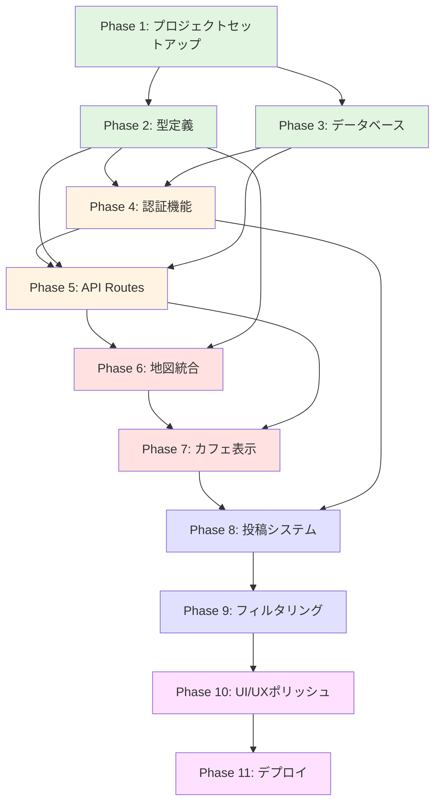
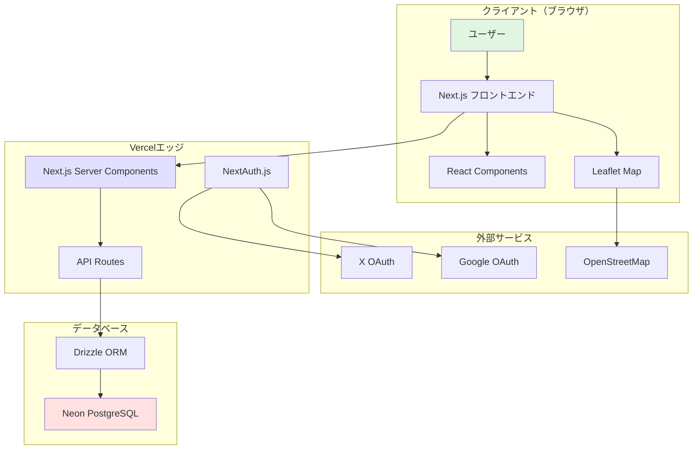
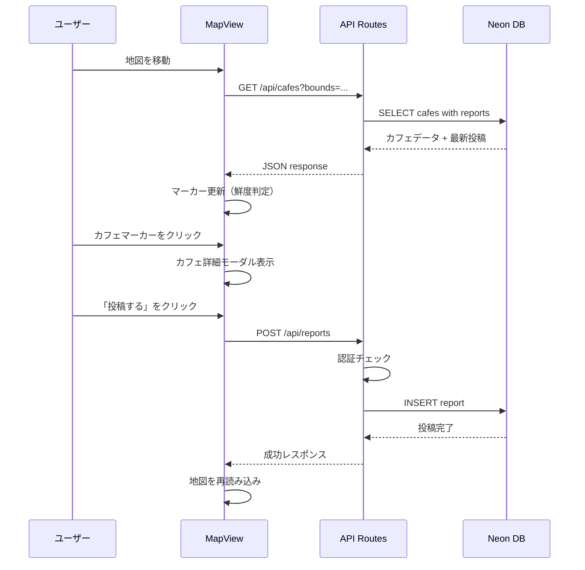

# WorkCafeFinder プロジェクト全体概要

**作成日**: 2025年10月23日
**ドキュメントバージョン**: 1.0
**対象者**: 開発者、プロジェクトマネージャー

---

## 目次

1. [プロジェクト概要](#プロジェクト概要)
2. [ビジョンと目的](#ビジョンと目的)
3. [開発方針と設計思想](#開発方針と設計思想)
4. [技術スタック詳細解説](#技術スタック詳細解説)
5. [全Phase一覧とフローチャート](#全phase一覧とフローチャート)
6. [開発スケジュール見積もり](#開発スケジュール見積もり)
7. [リスク管理マトリクス](#リスク管理マトリクス)
8. [成功基準（KPI）](#成功基準kpi)
9. [アーキテクチャ図](#アーキテクチャ図)

---

## プロジェクト概要

### プロジェクト名
**WorkCafeFinder (ワークカフェファインダー)**

### エグゼクティブサマリー

WorkCafeFinderは、「今、作業できるカフェ」を探すことに特化したユーザー参加型（CGM）マップアプリケーションです。フリーランス、ノマドワーカー、学生が、リアルタイムな情報（空席状況、静かさ、Wi-Fi速度、電源席の有無）を共有し、最適な作業環境を素早く見つけられるプラットフォームを提供します。

本プロジェクトは、Leaflet + OpenStreetMapによる完全無料の地図機能、NextAuth.jsによるソーシャルログイン認証、Neon PostgreSQL + Drizzle ORMによる高速なデータベース処理を組み合わせた、モダンなフルスタックNext.jsアプリケーションです。

### プロジェクトの背景

近年、リモートワークの普及により、カフェで作業する人が急増しています。しかし、既存のマップアプリ（Google Maps、Yelpなど）では、「今の混雑状況」「静けさ」「Wi-Fi速度」といった作業に必要な情報が分かりません。

本プロジェクトは、以下の課題を解決します:
- **リアルタイム性**: 3時間以内の新鮮な情報のみを表示
- **作業環境特化**: 空席、静かさ、Wi-Fi、電源という作業必須の4要素に絞った情報
- **コミュニティ駆動**: ユーザー参加型で情報を維持・更新

---

## ビジョンと目的

### ビジョン

> 「作業できるカフェを、今すぐ見つけられる世界を創る」
>
> フリーランスやノマドワーカーが、作業場所探しに時間を浪費せず、最適な環境で生産性を発揮できるプラットフォームを提供します。

### プロジェクトの目的

1. **リアルタイム情報の提供**
   - 3時間以内の新鮮な情報のみを表示
   - 古い情報は視覚的に区別（グレーアウト）
   - 24時間以上経過した情報は非表示

2. **ユーザー体験の最適化**
   - 直感的な地図UI（Leaflet）
   - ワンクリックでカフェ詳細表示
   - 簡単な投稿フォーム

3. **技術的実証**
   - Next.js 14の最新機能（App Router、Server Components）
   - Leaflet + OpenStreetMapの無料地図統合
   - NextAuth.jsによるソーシャルログイン
   - Neon PostgreSQLのサーバーレスDB活用

### ターゲットユーザー

| ユーザー層 | ニーズ | 利用シーン |
|-----------|--------|-----------|
| **フリーランス・ノマドワーカー** | カフェで仕事をする習慣がある | クライアント先の近くで作業場所を探す |
| **学生** | カフェで勉強したい、試験期間中の作業場所探し | 図書館が満席時の代替作業場所 |
| **リモートワーカー** | 自宅以外の作業場所を探している | 気分転換に外で作業したい |

---

## 開発方針と設計思想

### コア原則

#### 1. シンプルさの追求（KISS原則）
- **最小限の機能**: MVPに必要な機能のみ実装
- **直感的操作**: 説明不要のマップUI
- **クリーンコード**: TypeScriptによる型安全性と可読性の確保

#### 2. リアルタイム性の担保
- **鮮度管理**: 3時間以内の情報のみ通常表示
- **視覚的区別**: 古い情報はグレーアウト
- **自動非表示**: 24時間以上経過した情報は非表示

#### 3. コスト最小化
- **完全無料の地図**: Leaflet + OpenStreetMap
- **無料枠内のDB**: Neon PostgreSQL（0.5GB無料）
- **無料デプロイ**: Vercel（個人プロジェクト無料）

#### 4. ユーザーエクスペリエンス
- **モバイルファースト**: スマホでの利用を優先
- **高速表示**: Server Componentsによる初回ロード最適化
- **直感的フィルタリング**: ワンタップで条件絞り込み

### 技術的制約と意図的な省略

本MVPでは、以下の機能を**意図的にスコープ外**としています:

| 省略機能 | 理由 | 将来の拡張可能性 |
|---------|------|----------------|
| メールアドレス認証 | ハードル低減、SMTP不要 | Phase 2以降で追加検討 |
| リアルタイム更新（WebSocket） | サーバーレス環境では複雑 | Phase 3で検討 |
| カフェの新規登録 | MVP段階は管理者が手動登録 | Phase 2で追加 |
| お気に入り機能 | コア機能に集中 | Phase 3で追加 |
| プッシュ通知 | PWA化が必要 | Phase 4で検討 |

---

## 技術スタック詳細解説

### フロントエンド技術

#### Next.js 14 (App Router)

**選定理由:**
- **Server Components**: 初回ロードの高速化、SEO最適化
- **File-based Routing**: 直感的なルーティング設定
- **API Routes統合**: フロントエンドとバックエンドの統一環境
- **Vercel最適化**: デプロイの簡素化

**主要機能の活用:**
```typescript
// app/map/page.tsx (Server Component)
export default async function MapPage() {
  // サーバーサイドでの初期データ取得
  const cafes = await getCafesInBounds({...});
  return <MapClient initialCafes={cafes} />;
}

// components/map/MapClient.tsx (Client Component)
'use client';
export function MapClient({ initialCafes }) {
  // クライアントサイドのインタラクティブな操作
  const [cafes, setCafes] = useState(initialCafes);
  // ...
}
```

#### TypeScript 5+

**選定理由:**
- **型安全性**: コンパイル時のエラー検出
- **開発者体験**: IntelliSenseによる補完
- **リファクタリング容易性**: 型情報による安全な変更

**型システム設計方針:**
```typescript
// 厳格な型定義によるバグ防止
interface Cafe {
  id: string;
  name: string;
  address: string;
  latitude: number;
  longitude: number;
  latestReport?: Report | null;
}

interface Report {
  id: string;
  cafeId: string;
  userId: string;
  seatStatus: 'available' | 'crowded' | 'full';
  quietness: 'quiet' | 'normal' | 'noisy';
  wifi: 'fast' | 'normal' | 'slow' | 'none';
  powerOutlets: boolean;
  comment?: string | null;
  createdAt: Date;
}
```

#### Tailwind CSS 3+

**選定理由:**
- **高速開発**: ユーティリティクラスによる迅速なスタイリング
- **一貫性**: デザインシステムの統一
- **バンドルサイズ最適化**: 使用されたクラスのみ出力
- **カスタマイズ性**: tailwind.config.tsでの柔軟な設定

#### Leaflet + react-leaflet

**選定理由:**
- **完全無料**: Google Maps APIのような従量課金なし
- **軽量**: バンドルサイズが小さい（42KB gzip）
- **カスタマイズ性**: オープンソースで柔軟
- **コミュニティ**: プラグインが豊富

**使用機能:**
- マーカー表示（カフェの位置）
- 現在地表示（GPS）
- カスタムアイコン（カフェの状態で色分け）
- クリックイベント（カフェ詳細表示）

#### OpenStreetMap (OSM)

**選定理由:**
- **完全無料**: タイル配信コストなし
- **オープンデータ**: ライセンス制約が緩い
- **十分な品質**: MVP段階で十分な地図品質

### バックエンド・データベース技術

#### Neon PostgreSQL

**選定理由:**
- **サーバーレス**: 使用量に応じた自動スケーリング
- **無料枠**: 0.5GB ストレージ（MVPに十分）
- **高速接続**: HTTP接続によるコールドスタート最適化
- **Vercel統合**: 環境変数の自動設定

**接続方式:**
- HTTPベース接続（`@neondatabase/serverless`）
- コネクションプーリング不要

#### Drizzle ORM

**選定理由:**
- **軽量**: バンドルサイズが小さい（Prismaより軽量）
- **高速**: コールドスタート時間が短い
- **型安全**: TypeScriptファーストの設計
- **Neon最適化**: サーバーレス環境に最適

**スキーマ定義例:**
```typescript
// lib/db/schema.ts
import { pgTable, uuid, varchar, timestamp, decimal, boolean } from 'drizzle-orm/pg-core';

export const cafes = pgTable('cafes', {
  id: uuid('id').defaultRandom().primaryKey(),
  name: varchar('name', { length: 255 }).notNull(),
  address: varchar('address', { length: 512 }).notNull(),
  latitude: decimal('latitude', { precision: 10, scale: 7 }).notNull(),
  longitude: decimal('longitude', { precision: 10, scale: 7 }).notNull(),
  createdAt: timestamp('created_at', { mode: 'date' }).defaultNow().notNull(),
  updatedAt: timestamp('updated_at', { mode: 'date' }).defaultNow().notNull(),
});
```

### 認証・認可

#### NextAuth.js

**選定理由:**
- Next.jsとの完全統合
- 主要OAuthプロバイダーのサポート
- セッション管理が簡単
- セキュアなトークン管理

**実装方針:**
- **認証プロバイダー**: Google, X (Twitter)
- **セッション**: JWTベース
- **データベース**: Neon PostgreSQL（ユーザー情報保存）

**メールアドレス登録を避ける理由:**
- ユーザーのハードルを下げる
- SMTP設定不要（コスト削減）
- ソーシャルログインで十分な信頼性

### デプロイ・インフラ

#### Vercel

**選定理由:**
- **Next.js最適化**: 開発元による完全サポート
- **自動CI/CD**: GitHubプッシュで自動デプロイ
- **エッジネットワーク**: グローバルCDN
- **無料枠**: 個人プロジェクトに十分

---

## 全Phase一覧とフローチャート

### Phase概要

プロジェクトは11のPhaseに分割され、段階的に機能を実装します。Phase 1-11が**MVP（Minimum Viable Product）**として開発されます。

### Phase詳細

#### Phase 1: プロジェクトセットアップ（時間見積: 30-45分）

**目的:** 開発環境の構築とベース設定

**タスク:**
1. Next.js 14プロジェクト初期化
2. TypeScript設定
3. Tailwind CSS設定
4. 依存パッケージインストール
5. ディレクトリ構造作成
6. Git初期化
7. ESLint/Prettier設定

**成果物:**
- 動作するNext.js開発サーバー
- 全設定ファイルの完成

**詳細ドキュメント:** `20251023_01-project-setup.md`

---

#### Phase 2: 型定義とユーティリティ（時間見積: 30-45分）

**目的:** TypeScript型システムの構築と共通ユーティリティ関数の実装

**タスク:**
1. Cafe型定義
2. Report型定義
3. User型定義
4. API Response型定義
5. ユーティリティ関数（鮮度判定、位置情報計算）

**成果物:**
- 完全な型定義ファイル
- 型安全なユーティリティ関数

**詳細ドキュメント:** `20251023_02-type-definitions.md`

---

#### Phase 3: データベースセットアップ（時間見積: 45-60分）

**目的:** Neon PostgreSQLとDrizzle ORMの設定

**タスク:**
1. Neonアカウント作成とデータベース作成
2. Drizzle ORMスキーマ定義
3. マイグレーション実行
4. データベースクエリ関数
5. シードデータ投入

**成果物:**
- 動作するデータベース接続
- cafes, reports, usersテーブル

**詳細ドキュメント:** `20251023_03-database-foundation.md`

---

#### Phase 4: 認証機能（時間見積: 60-90分）

**目的:** NextAuth.jsによるソーシャルログイン実装

**タスク:**
1. NextAuth.js設定
2. Google OAuth設定
3. X (Twitter) OAuth設定
4. ユーザーセッション管理
5. 保護されたルート実装

**成果物:**
- Google/Xでのログイン機能
- ユーザー情報の永続化

**詳細ドキュメント:** `20251023_04-authentication-setup.md`

---

#### Phase 5: API Routes実装（時間見積: 60-90分）

**目的:** カフェ情報と投稿のCRUD API

**タスク:**
1. `GET /api/cafes` - カフェ一覧取得
2. `GET /api/cafes/[id]` - カフェ詳細取得
3. `POST /api/reports` - 投稿作成
4. `GET /api/reports` - 投稿一覧取得
5. エラーハンドリング
6. バリデーション

**成果物:**
- RESTful API
- データベース連携

**詳細ドキュメント:** `20251023_05-api-routes.md`

---

#### Phase 6: 地図統合（時間見積: 90-120分）

**目的:** Leaflet + OpenStreetMapの統合

**タスク:**
1. Leaflet設定
2. MapViewコンポーネント実装
3. 現在地取得（GPS）
4. 地図移動イベントハンドリング
5. デバウンス処理
6. SSR無効化（dynamic import）

**成果物:**
- 動作する地図表示
- 現在地マーカー

**詳細ドキュメント:** `20251023_06-map-integration.md`

---

#### Phase 7: カフェ表示機能（時間見積: 60-90分）

**目的:** カフェマーカーと詳細表示

**タスク:**
1. CafeMarkerコンポーネント
2. カスタムアイコン（鮮度別色分け）
3. カフェ詳細モーダル
4. ReportCardコンポーネント
5. 投稿履歴表示

**成果物:**
- 地図上のカフェマーカー
- カフェ詳細モーダル

**詳細ドキュメント:** `20251023_07-cafe-display.md`

---

#### Phase 8: 投稿システム（時間見積: 90-120分）

**目的:** カフェ情報投稿機能

**タスク:**
1. ReportFormコンポーネント
2. フォームバリデーション
3. 投稿API連携
4. 認証チェック
5. エラーハンドリング
6. 成功通知

**成果物:**
- 投稿フォーム
- 投稿処理

**詳細ドキュメント:** `20251023_08-report-system.md`

---

#### Phase 9: フィルタリング・鮮度管理（時間見積: 45-60分）

**目的:** フィルタリング機能と鮮度判定ロジック

**タスク:**
1. MapFiltersコンポーネント
2. フィルタリングロジック
3. 鮮度判定関数
4. マーカー色分け
5. 古い情報のグレーアウト

**成果物:**
- フィルタリング機能
- 鮮度管理ロジック

**詳細ドキュメント:** `20251023_09-filtering-freshness.md`

---

#### Phase 10: UI/UXポリッシュ（時間見積: 60-90分）

**目的:** UI/UX改善、エッジケース対応

**タスク:**
1. ローディング状態
2. エラーメッセージ改善
3. レスポンシブデザイン調整
4. アクセシビリティ対応
5. パフォーマンス最適化

**成果物:**
- 洗練されたUI/UX
- エッジケース対応

**詳細ドキュメント:** `20251023_10-ui-ux-polish.md`

---

#### Phase 11: Vercelデプロイ（時間見積: 30-45分）

**目的:** 本番環境へのデプロイ

**タスク:**
1. 環境変数設定
2. Vercelプロジェクト作成
3. GitHub連携
4. 自動デプロイ設定
5. 動作確認
6. デモ用データ投入

**成果物:**
- 本番環境で動作するアプリケーション
- 公開URL

**詳細ドキュメント:** `20251023_11-vercel-deployment.md`

---

### Phase間の依存関係フローチャート



**凡例:**
- 緑色: セットアップ系（Phase 1-3）
- 黄色: 基盤実装（Phase 4-5）
- 赤色: 地図・表示機能（Phase 6-7）
- 青色: 投稿・フィルタリング（Phase 8-9）
- 紫色: 仕上げ・デプロイ（Phase 10-11）

---

## 開発スケジュール見積もり

### 総見積時間: 10 - 14時間

### タスクブレイクダウン（累計時間）

| Phase | タスク | 最小時間 | 最大時間 | 累計（最大） |
|-------|--------|---------|---------|------------|
| **Phase 1** | プロジェクトセットアップ | 30分 | 45分 | 0:45 |
| **Phase 2** | 型定義 | 30分 | 45分 | 1:30 |
| **Phase 3** | データベース | 45分 | 60分 | 2:30 |
| **Phase 4** | 認証機能 | 60分 | 90分 | 4:00 |
| **Phase 5** | API Routes | 60分 | 90分 | 5:30 |
| **Phase 6** | 地図統合 | 90分 | 120分 | 7:30 |
| **Phase 7** | カフェ表示 | 60分 | 90分 | 9:00 |
| **Phase 8** | 投稿システム | 90分 | 120分 | 11:00 |
| **Phase 9** | フィルタリング | 45分 | 60分 | 12:00 |
| **Phase 10** | UI/UXポリッシュ | 60分 | 90分 | 13:30 |
| **Phase 11** | デプロイ | 30分 | 45分 | **14:15** |

### 開発モデル: アジャイルスプリント

**スプリント構成:**
- **Sprint 1（2-3時間）**: Phase 1-3（基盤構築）
- **Sprint 2（3-4時間）**: Phase 4-5（認証・API）
- **Sprint 3（3-4時間）**: Phase 6-7（地図・表示）
- **Sprint 4（3-4時間）**: Phase 8-9（投稿・フィルター）
- **Sprint 5（2時間）**: Phase 10-11（仕上げ・デプロイ）

**バッファ時間:**
予期しない問題に備えて、総見積時間の20%（約3時間）をバッファとして確保:

**合計開発時間: 14.25時間 + 3時間バッファ = 約17時間**

**実稼働日数見積:**
- **集中開発**: 2-3日（1日6時間作業）
- **通常ペース**: 4-5日（1日3-4時間作業）

---

## リスク管理マトリクス

### リスク評価基準

**影響度:**
- 高: プロジェクト完成に致命的
- 中: 機能制限が発生
- 低: 軽微な影響

**発生確率:**
- 高: 50%以上
- 中: 20-50%
- 低: 20%未満

### リスク一覧

| ID | リスク項目 | 影響度 | 確率 | リスクレベル | 軽減策 | 対応策 |
|----|-----------|-------|------|------------|--------|--------|
| R1 | Neon無料枠の制限超過 | 中 | 低 | 低 | データ量監視、最適化 | 有料プランへのアップグレード |
| R2 | Leafletの学習曲線 | 中 | 中 | 中 | 公式ドキュメント精読、サンプルコード参照 | Mapboxへの切り替え検討 |
| R3 | 位置情報許可の拒否率 | 中 | 中 | 中 | デフォルト位置（東京駅）表示、許可を促すUI | 手動で地図移動を促す |
| R4 | OAuth設定の複雑性 | 中 | 中 | 中 | NextAuth.js公式ドキュメント参照 | メールアドレス認証への切り替え |
| R5 | パフォーマンス問題（多数のマーカー） | 低 | 中 | 低 | マーカークラスタリング | 表示範囲の制限 |
| R6 | Vercelデプロイエラー | 高 | 低 | 中 | ローカルで`npm run build`テスト | ビルドログ確認、環境変数確認 |
| R7 | セキュリティ脆弱性（XSS等） | 高 | 中 | 高 | サニタイゼーション実装 | セキュリティ監査、ライブラリ更新 |
| R8 | スコープクリープ | 中 | 高 | 高 | 厳格なPhase管理 | Phase 2以降を後回し |

---

## 成功基準（KPI）

### 技術的KPI

| 指標 | 目標値 | 測定方法 |
|------|--------|---------|
| **ビルド成功率** | 100% | `npm run build`の成功 |
| **TypeScript型エラー** | 0件 | `npm run type-check` |
| **ESLint警告** | 5件以下 | `npm run lint` |
| **バンドルサイズ** | 300KB以下 | Webpack Bundle Analyzer |
| **Lighthouse Performance** | 85点以上 | Lighthouse CI |
| **Lighthouse Accessibility** | 90点以上 | Lighthouse CI |
| **初回ロード時間** | 2秒以下 | Chrome DevTools |

### 機能的KPI

| 機能 | 成功基準 |
|------|---------|
| **地図表示** | 3秒以内に読み込み完了 |
| **現在地取得** | 5秒以内にGPS取得 |
| **カフェマーカー表示** | 100件のマーカーをスムーズに表示 |
| **投稿機能** | 認証済みユーザーが投稿可能 |
| **フィルタリング** | 即座に結果を反映 |
| **クロスブラウザ** | Chrome, Firefox, Safariで動作 |

### ユーザー体験KPI

| 指標 | 目標 |
|------|------|
| **初回利用での理解** | 説明なしで操作可能 |
| **カフェ情報確認までの時間** | 30秒以内 |
| **投稿完了までの時間** | 1分以内 |
| **モバイル対応** | スマホでスムーズに操作可能 |

---

## アーキテクチャ図

### システム全体構成図



### データフロー図



---

## 次のステップ

### 今すぐ開始

1. **Phase 1ドキュメントを確認**
   - `20251023_01-project-setup.md`を開く
   - プロジェクトセットアップ手順に従う

2. **開発環境の準備**
   - Node.js 18.x以上をインストール
   - VSCodeまたは好みのエディタを準備
   - Gitをインストール

3. **Neonアカウント作成**
   - https://neon.tech でアカウント作成
   - 新しいプロジェクトを作成
   - 接続文字列をコピー

4. **OAuth認証設定**
   - Google Cloud Consoleでプロジェクト作成
   - X Developer Portalでアプリケーション作成

### 推奨の学習リソース

- **Next.js公式ドキュメント**: https://nextjs.org/docs
- **Leaflet公式ドキュメント**: https://leafletjs.com/
- **Drizzle ORM**: https://orm.drizzle.team/
- **NextAuth.js**: https://next-auth.js.org/
- **Tailwind CSS**: https://tailwindcss.com/docs

---

## まとめ

WorkCafeFinderプロジェクトは、11のPhaseに分かれた体系的な開発計画により、約14-17時間で完成予定です。Next.js 14、Leaflet + OpenStreetMap、NextAuth.js、Drizzle ORM、Neon PostgreSQLといった最新技術スタックを活用し、「今、作業できるカフェ」を見つけられるユーザー参加型マップアプリケーションを実現します。

段階的な開発アプローチにより、各Phaseで明確な成果物を生み出し、最終的にはVercelで公開される完全なWebアプリケーションとなります。

**次のドキュメント:** `20251023_01-project-setup.md`（プロジェクトセットアップ詳細手順）

---

**ドキュメント作成者**: AI Agent (Claude)
**最終更新日**: 2025年10月23日
**バージョン**: 1.0
